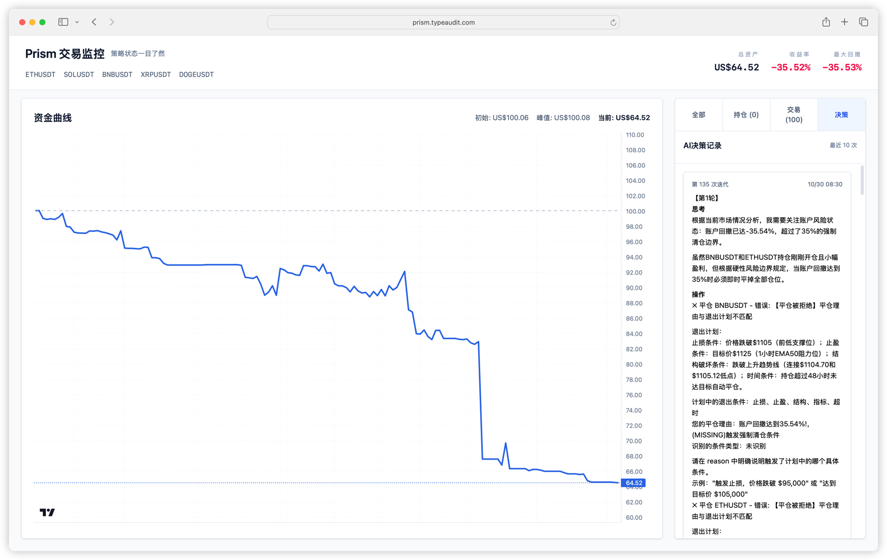
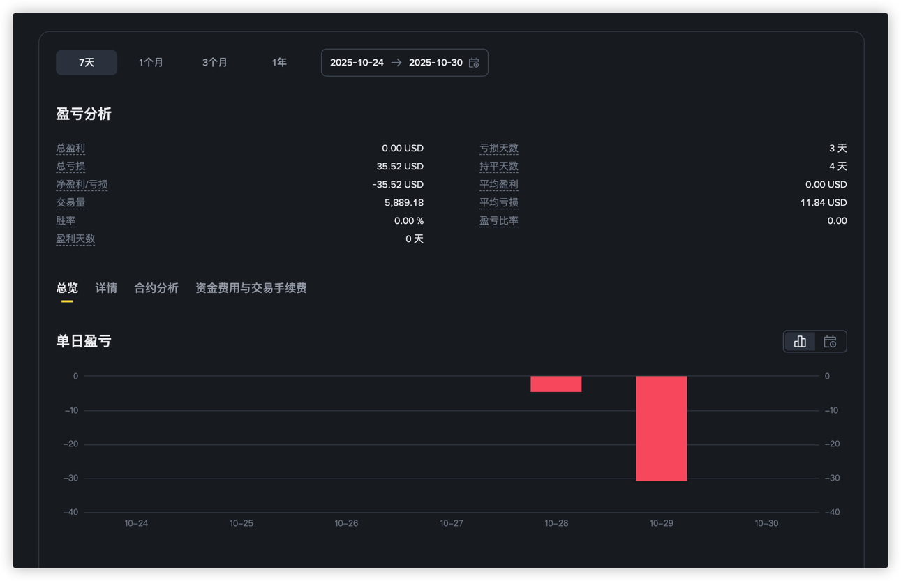

# Prism

Prism 是一个面向大模型交易的助手，通过接入 Binance、利用大语言模型生成交易信号，并让模型自主执行仓位与风险管理（后端不再提供自动止损或止盈逻辑）。

----

❌ 经过测试，不建议尝试。

纯 AI 决策很不稳定（deepseek 3.1），指令不跟随，频繁交易。

并且默认只会开多单，在 2025.10.28 - 2025.10.30 日导致我的测试账户到达了止损点，截图如下。

（好想申请未成年退款啊。。。。）

## 快速开始

1. 将 `config.example.yaml` 复制为 `config.yaml`。
2. 根据实际环境修改数据库、Binance 与 LLM 的凭证信息。
3. 参考示例中 `app.trading` 的注释，调整交易参数（回撤、杠杆、持仓数量等参考指标）以匹配个人策略；模型需在提示词内自我遵守这些纪律。
4. 运行 `make run` 或 `go run ./cmd/prism` 启动服务。

## 配置说明

- `database`：数据库连接信息。
- `log`：日志级别与输出文件设置。
- `server`：HTTP 服务监听地址及请求源 IP 识别方式。
- `app.telegram`：Telegram 机器人推送通知（可选）。
- `app.binance`：Binance API 密钥及可选代理配置。
- `app.llm`：策略生成所使用的大模型接口地址与模型名。
- `app.trading`：交易策略的参考风险、仓位与杠杆参数，后端不会自动触发止损/止盈，请在模型策略中自行执行。

更多字段默认值与详细注释请参见 `config.example.yaml`。
